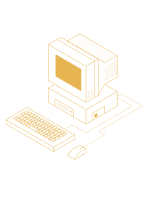

# My name is Gabe Kamalakis,

I am a software engineer who likes to dabble in a lot of different things, but I'm primarily:
- an aspiring DevOps engineer
- a full-stack web-developer
- a 3D Artist (with Blender and MagicaVoxel)
- Amateur woodworker
- Note-taking enthusiast
- Neovim Enjoyer

## Current Projects:
- A new type of note-taking application
- My custom dotfiles
- K8's cluster

## Languages and Frameworks I like to use:
- Rust
- Python
- Vue.js
- Warp
- C

I'm not just on Github, also check out my gitlab over here: 

You can also check out my 

<!---
omarkamalakis/omarkamalakis is a ✨ special ✨ repository because its `README.md` (this file) appears on your GitHub profile.
You can click the Preview link to take a look at your changes.
--->
